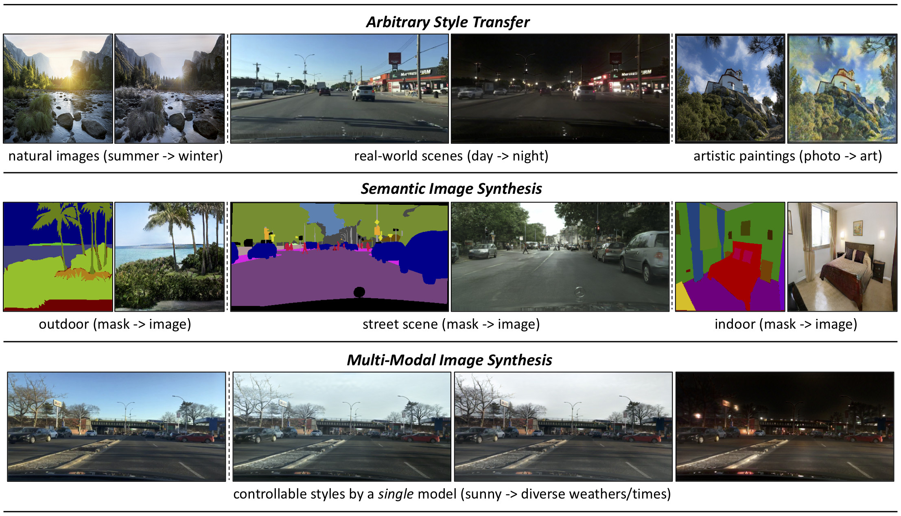

# TSIT: A Simple and Versatile Framework for Image-to-Image Translation



This repository provides the official PyTorch implementation for the following paper:

**TSIT: A Simple and Versatile Framework for Image-to-Image Translation**<br>
[Liming Jiang](https://liming-jiang.com/),  [Changxu Zhang](http://zhangcx.top/), Mingyang Huang, [Chunxiao Liu](https://scholar.google.com/citations?user=4m061tYAAAAJ&hl=en&oi=ao), [Jianping Shi](http://shijianping.me/) and [Chen Change Loy](http://personal.ie.cuhk.edu.hk/~ccloy/)<br>
In ECCV 2020 (Spotlight).<br>
[**Paper**](https://arxiv.org/abs/2007.12072)
> **Abstract:** *We introduce a simple and versatile framework for image-to-image translation. We unearth the importance of normalization layers, and provide a carefully designed two-stream generative model with newly proposed feature transformations in a coarse-to-fine fashion. This allows multi-scale semantic structure information and style representation to be effectively captured and fused by the network, permitting our method to scale to various tasks in both unsupervised and supervised settings. No additional constraints (e.g., cycle consistency) are needed, contributing to a very clean and simple method. Multi-modal image synthesis with arbitrary style control is made possible. A systematic study compares the proposed method with several state-of-the-art task-specific baselines, verifying its effectiveness in both perceptual quality and quantitative evaluations.*

## Updates

- [01/2021] The **code** of TSIT is **released**.

- [07/2020] The [paper](https://arxiv.org/abs/2007.12072) of TSIT is accepted by **ECCV 2020 (Spotlight)**.

## Installation

After installing [Anaconda](https://www.anaconda.com/), we recommend you to create a new conda environment with python 3.7.6:

```bash
conda create -n tsit python=3.7.6 -y
conda activate tsit
```

Clone this repo, install PyTorch 1.1.0 (newer versions may also work) and other dependencies:

```bash
git clone https://github.com/EndlessSora/TSIT.git
cd TSIT
pip install -r requirements.txt
```

This code also requires the Synchronized-BatchNorm-PyTorch:

```bash
cd models/networks/
git clone https://github.com/vacancy/Synchronized-BatchNorm-PyTorch
cp -rf Synchronized-BatchNorm-PyTorch/sync_batchnorm .
rm -rf Synchronized-BatchNorm-PyTorch
cd ../../
```

## Tasks and Datasets

The code covers 3 image-to-image translation tasks on 5 datasets. For more details, please refer to our [paper](https://arxiv.org/abs/2007.12072).

### Task Abbreviations

* **Arbitrary Style Transfer (AST)** on *Yosemite summer → winter*, *BDD100K day → night*, and *Photo → art* datasets.
* **Semantic Image Synthesis (SIS)** on *Cityscapes* and *ADE20K* datasets.
* **Multi-Modal Image Synthesis (MMIS)** on *BDD100K sunny → different time/weather conditions* dataset.

The abbreviations are used to specify the `--task` argument when training and testing.

### Dataset Preparation

We provide one-click scripts to prepare datasets. The details are provided below.

* **Yosemite summer → winter** and **Photo → art**. The provided scripts will make all things ready (including the download). For example, simply run:

```bash
bash datasets/prepare_summer2winteryosemite.sh
```

* **BDD100K**. Please first download BDD100K [Images](https://doc.bdd100k.com/download.html#images) on their [official website](https://bdd-data.berkeley.edu/). We have provided the classified [lists](./datasets/bdd100k_lists) of different weathers and times. After downloading, you only need to run:

```bash
bash datasets/prepare_bdd100k.sh [data_root]
```

The `[data_root]` should be specified, which is the path to the BDD100K root folder that contains `images` folder. The script will put the list to the suitable place and symlink the root folder to `./datasets`.

* **Cityscapes**. Please follow the standard download and preparation guidelines on the [official website](https://www.cityscapes-dataset.com/). We recommend to symlink its root folder `[data_root]` to `./datasets` by:

```bash
bash datasets/prepare_cityscapes.sh [data_root]
```

* **ADE20K**. The dataset can be downloaded [here](http://data.csail.mit.edu/places/ADEchallenge/ADEChallengeData2016.zip), which is from [MIT Scene Parsing BenchMark](http://sceneparsing.csail.mit.edu/). After unzipping the dataset, put the jpg image files `ADEChallengeData2016/images/` and png label files `ADEChallengeData2016/annotatoins/` in the same directory. We also recommend to symlink its root folder `[data_root]` to `./datasets` by:

```bash
bash datasets/prepare_ade20k.sh [data_root]
```

## Testing Pretrained Models

1. Download the [pretrained models](https://drive.google.com/file/d/1eyLqSOifR1-UGY8yg8DrW6q7GSHKxCof/view?usp=sharing) and unzip them to `./checkpoints`.

2. For a quick start, we have provided all the example [test scripts](./test_scripts). After preparing the corresponding datasets, you can directly use the test scripts. For example:

```bash
bash test_scripts/ast_summer2winteryosemite.sh
```

3. The generated images will be saved at `./results/[experiment_name]` by default.

4. You can use `--results_dir` to specify the output directory. `--how_many` will specify the maximum number of images to generate. By default, the code loads the latest checkpoint, which can be changed using `--which_epoch`. You can also discard `--show_input` to show the generated images only without the input references.

5. For *MMIS sunny → different time/weather conditions*, the `--test_mode` can be specified (optional): `night` | `cloudy` | `rainy` | `snowy` | `all` (default).

## Training

For a quick start, we have provided all the example [training scripts](./train_scripts). After preparing the corresponding datasets, you can directly use the training scripts. For example:

```bash
bash train_scripts/ast_summer2winteryosemite.sh
```

**Please note that** you may want to change the experiment name `--name` or the checkpoint saving root `--checkpoints_dir` to prevent your newly trained models overwriting the pretrained ones (if used).

`--task` is given using the [abbreviations](#task-abbreviations). `--dataset_mode` specifies the dataset type. `--croot` and `--sroot` specify the content and style data root, respectively. The results may be better reproduced on NVIDIA Tesla V100 GPUs.

After training, testing the newly trained models is similar to [testing pretrained models](#testing-pretrained-models).

## Citation

If you find this work useful for your research, please cite our paper:

```
@inproceedings{jiang2020tsit,
  title={{TSIT}: A Simple and Versatile Framework for Image-to-Image Translation},
  author={Jiang, Liming and Zhang, Changxu and Huang, Mingyang and Liu, Chunxiao and Shi, Jianping and Loy, Chen Change},
  booktitle={ECCV},
  year={2020}
}
```

## Acknowledgments

The code is greatly inspired by [SPADE](https://github.com/NVlabs/SPADE), [pytorch-AdaIN](https://github.com/naoto0804/pytorch-AdaIN), and [Synchronized-BatchNorm-PyTorch](https://github.com/vacancy/Synchronized-BatchNorm-PyTorch).

## License

Copyright (c) 2020. All rights reserved.

The code is licensed under the [CC BY-NC-SA 4.0](https://creativecommons.org/licenses/by-nc-sa/4.0/legalcode) (**Attribution-NonCommercial-ShareAlike 4.0 International**).
